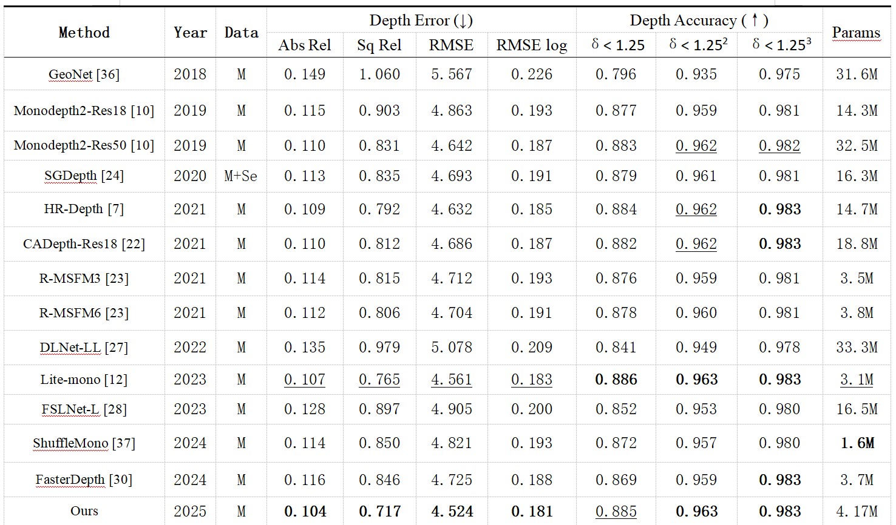

# LiFME-Depth

Enhancing Monocular Depth Estimation: A Feature-Enhanced Network with Superior Generalization


If you think it is a useful work, please consider citing it.
```
@inproceedings{
  title={Enhancing Monocular Depth Estimation: A Feature-Enhanced Network with Superior Generalization},
  author={Wei Chen,Xiang Li},
  year={2025}
}

```

## Overview of LiFME-Depth


## Basic results on KITTI dataset



## Visualization Results of Resolution Adaptation


## Training:

```
CUDA_VISIBLE_DEVICES=0 python train.py --model_name LiFME-Depth -data_path /datasets/Kitti/
```

## Testing:

```
CUDA_VISIBLE_DEVICES=0 python evaluate_depth.py --load_weights_folder /models/ LiFME-Depth/ --eval_mono --height 192 --width 640
```

## Infer a single depth map from a RGB:
```
CUDA_VISIBLE_DEVICES=0 python test_simple.py --image_path /test.png --model_name  LiFME-Depth
```

## Environments:
```
python: 3.9.0
torch: 2.0.1
```

#### Acknowledgement

 - Thank the authors for their superior works: [monodepth2](https://github.com/nianticlabs/monodepth2), [lidut-depth](https://github.com/haoo999/LiDUT-Depth).
 
 
